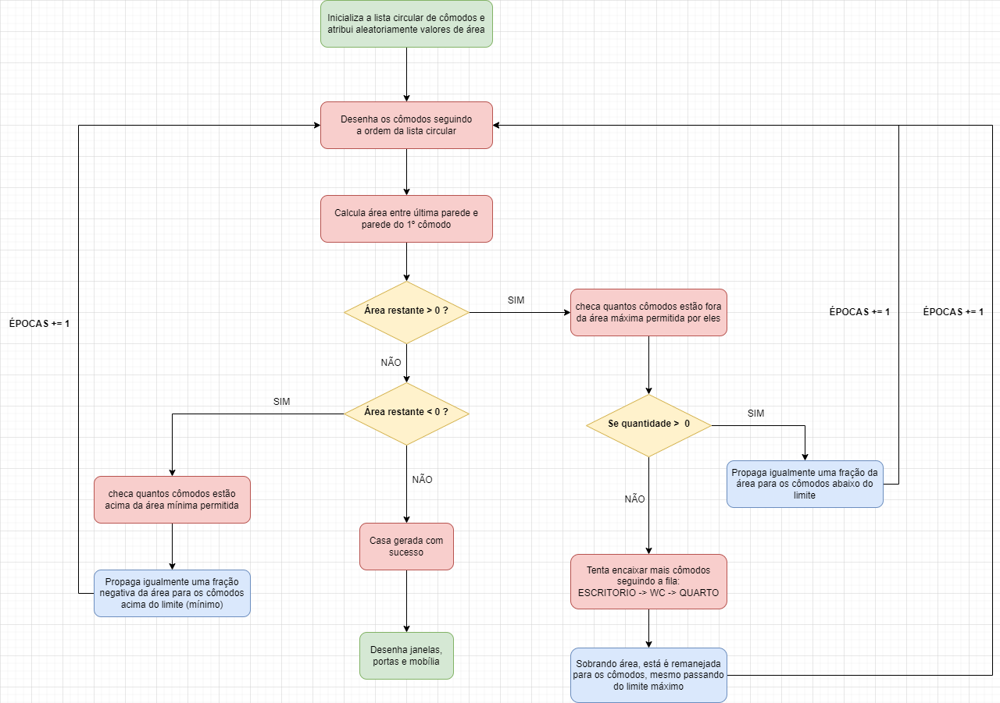
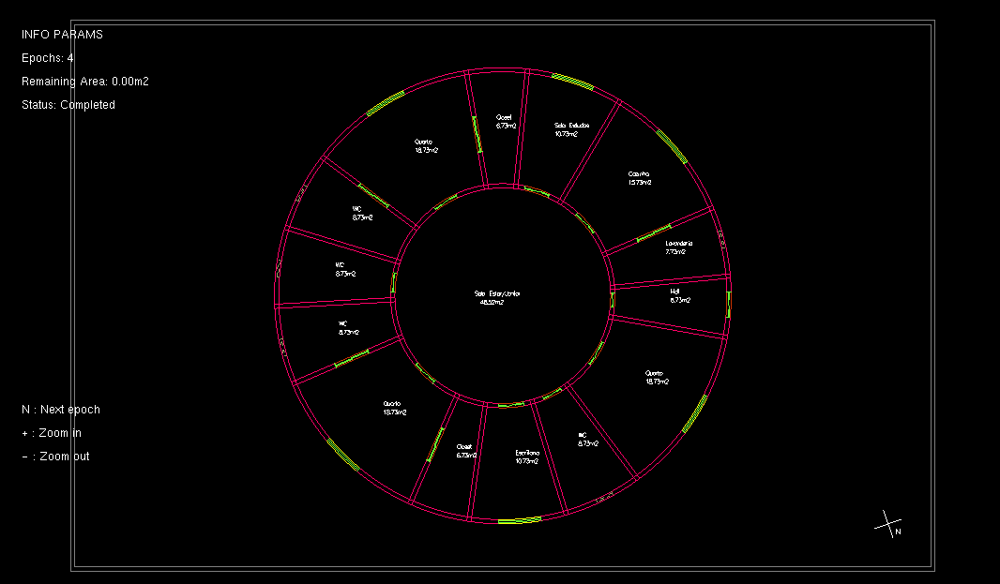

## Blueprint Project

An Automatic Blueprints Generator Software made with the C language using the OpenGL API.

Um Gerador de plantas baixas automático feito em C usando a API OpenGL.

### Membros do Grupo

- Thiago Ribeiro
- Diogo Tallys
- Taisa Lima
- José Endson

### Entradas

O programa recebe as informações de largura e altura do terreno, considerando que
as mesmas devem possibilitar a inserção da casa circular com distância mínima de 1.5 
metros entre os limites. A área da casa pode variar numa faixa de 120 - 210 m².
Por fim, ele recebe a informação do norte, que determina a posição dos quartos na casa.

### Algoritmo de Adaptação

O fluxograma abaixo apresenta como o algoritmo funciona. Cada época corresponde a uma nova
atualização das áreas dos cômodos. No final, as janelas e portas são colocadas e a casa é
finalizada.

Pressionando "N", o algoritmo é acionado e então uma nova época é gerada, até que se finalize:

